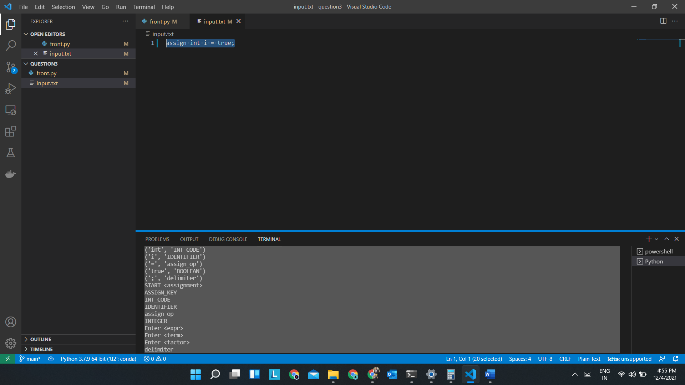
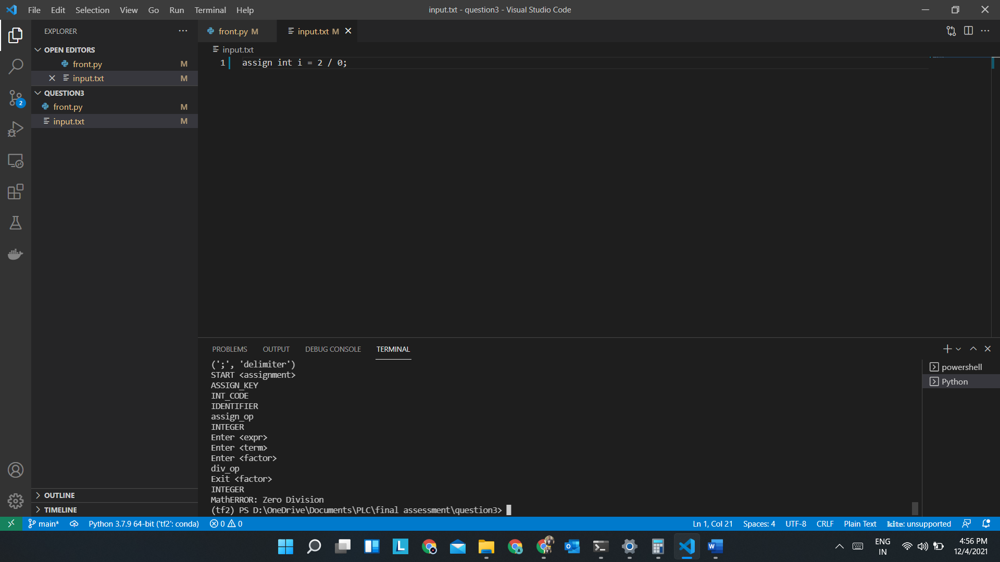
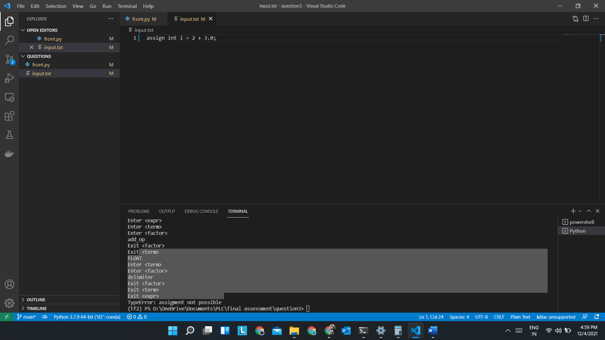
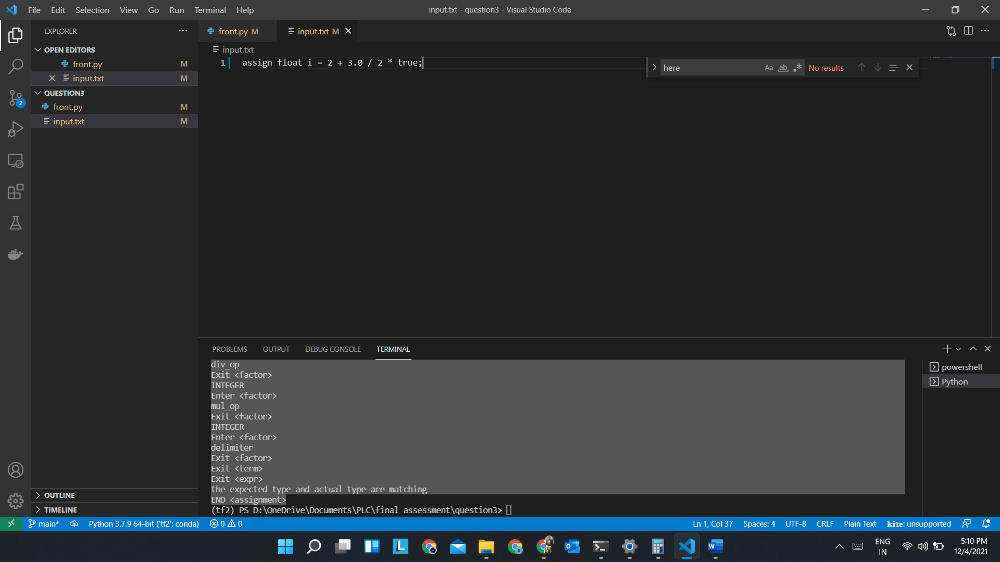

# PLC_final_assesment
codes for practical for PLC final assessment

#### Disclaimer: the code is open source but please do not copy for university assignments as you might get into trouble for academic malpractice

Question 3
here to change your input edit the input.txt where you can enter a assign statement in the following format

assign "datatype" "IDENTIFIER" = Expression ;

**Scenarios:**

*Boolean Coercion*

*Output:*
 
(tf2) PS D:\OneDrive\Documents\PLC\final assessment\question3> python .\front.py  
('assign', 'ASSIGN_KEY')  
('int', 'INT_CODE')  
('i', 'IDENTIFIER')  
('=', 'assign_op')  
('true', 'BOOLEAN')  
(';', 'delimiter')  
START assignment  
ASSIGN_KEY  
INT_CODE  
IDENTIFIER  
assign_op  
INTEGER  
Enter expr  
Enter term  
Enter factor  
delimiter  
Exit factor  
Exit term  
Exit expr  
the expected type and actual type are matching  
END assignment  

*Division by zero*

*Output:*
 
(tf2) PS D:\OneDrive\Documents\PLC\final assessment\question3> python .\front.py  
('assign', 'ASSIGN_KEY')  
('int', 'INT_CODE') 
('i', 'IDENTIFIER') 
('=', 'assign_op') 
('2', 'INTEGER') 
('/', 'div_op') 
('0', 'INTEGER') 
(';', 'delimiter') 
START assignment 
ASSIGN_KEY 
INT_CODE 
IDENTIFIER 
assign_op 
INTEGER 
Enter expr 
Enter term 
Enter factor 
div_op 
Exit factor  
INTEGER  
MathERROR: Zero Division  

*Type mismatch*

*Output:*
 
(tf2) PS D:\OneDrive\Documents\PLC\final assessment\question3> python .\front.py  
('assign', 'ASSIGN_KEY')  
('int', 'INT_CODE')  
('i', 'IDENTIFIER')  
('=', 'assign_op')  
('2', 'INTEGER')  
('+', 'add_op')  
('3.0', 'FLOAT')  
(';', 'delimiter')  
START assignment  
ASSIGN_KEY  
INT_CODE  
IDENTIFIER  
assign_op  
INTEGER  
Enter expr  
Enter term  
Enter factor  
add_op  
Exit factor  
Exit term  
FLOAT  
Enter term  
Enter factor  
delimiter  
Exit factor  
Exit term  
Exit expr  
TypeError: assignment not possible  

*Positive case with type casting*

*Output:*
 
(tf2) PS D:\OneDrive\Documents\PLC\final assessment\question3> python .\front.py  
('assign', 'ASSIGN_KEY')  
('float', 'FLOAT_CODE')  
('i', 'IDENTIFIER')  
('=', 'assign_op')  
('2', 'INTEGER')  
('+', 'add_op')  
('3.0', 'FLOAT')  
('/', 'div_op')  
('2', 'INTEGER')  
('*', 'mul_op')  
('true', 'BOOLEAN')  
(';', 'delimiter')  
START <assignment>  
ASSIGN_KEY  
FLOAT_CODE   
IDENTIFIER  
assign_op  
INTEGER  
Enter expr  
Enter term  
Enter factor  
add_op  
Exit factor  
Exit term  
FLOAT  
Enter term  
Enter factor  
div_op  
Exit factor  
INTEGER  
Enter factor  
mul_op  
Exit factor  
INTEGER  
Enter factor  
delimiter  
Exit factor  
Exit term   
Exit expr  
the expected type and actual type are matching  
END assignment
